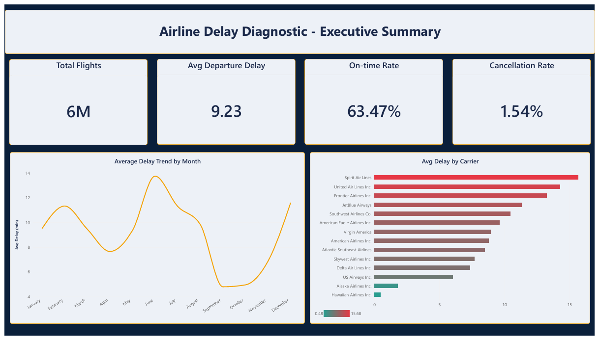
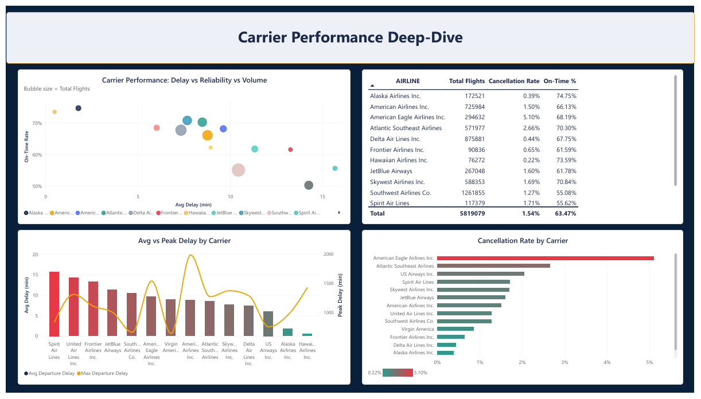
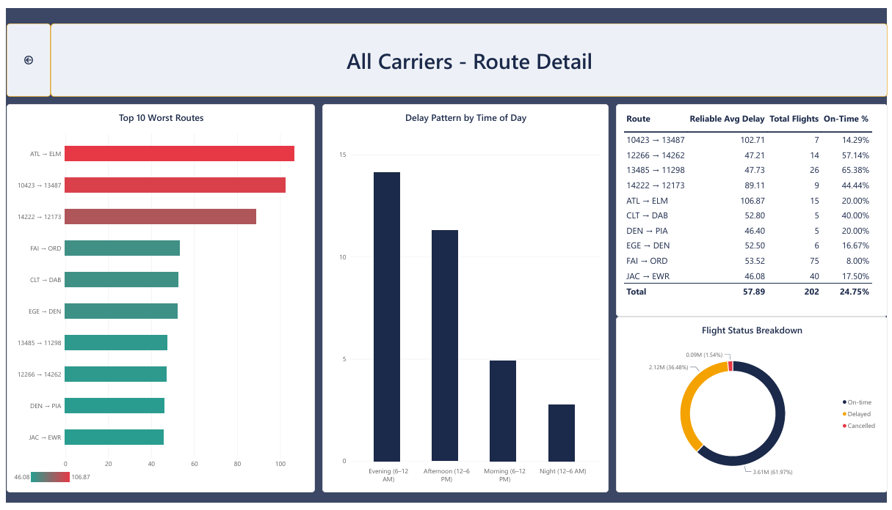
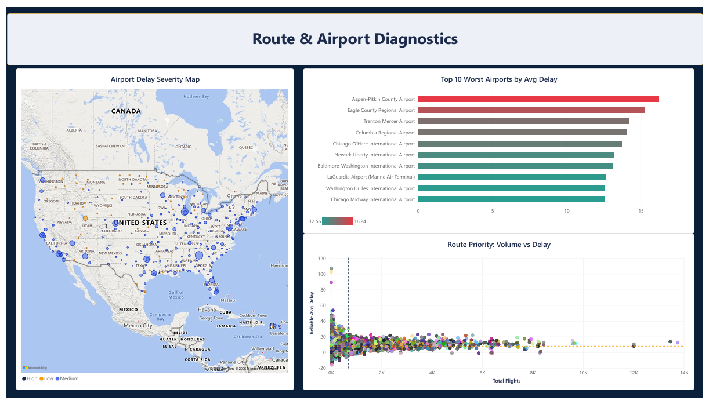
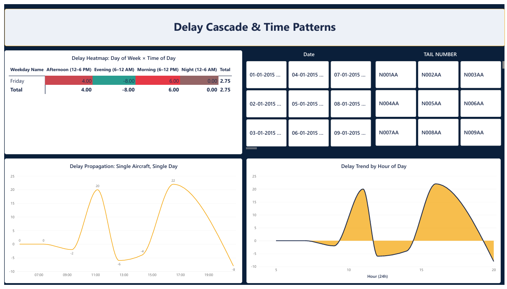
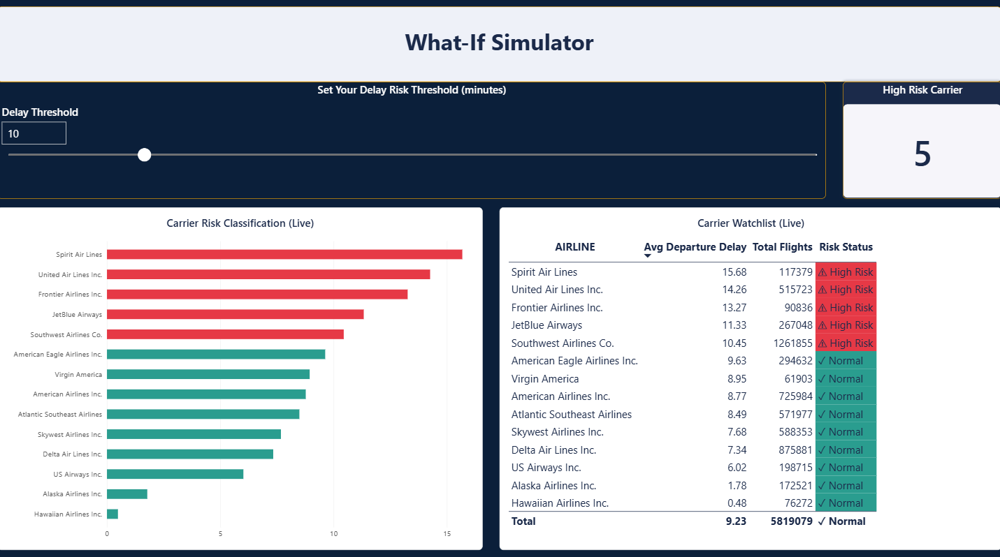

# Airline Delay & Bottleneck Diagnostic — Power BI Phase

Part 3 of the Tool Mastery Series: the same airline delay business problem, solved across Excel, SQL, Power BI, and Python to demonstrate cross-tool analytical proficiency.

## Objective

Diagnose where and why flight delays occur across a national carrier network — which airlines, routes, airports, and time windows drive the most disruption — and build an interactive tool that lets a stakeholder explore the data themselves rather than read a static report.

## Data Source

Kaggle 2015 Flight Delays and Cancellations dataset (`flights`, `airlines`, `airports` tables), connected live to a MySQL database (built and populated during the SQL phase of this series) rather than imported as a static CSV. Full-year 2015 data — 5.82M flights.

## Why Power BI

Where the Excel phase delivered a static dashboard and the SQL phase focused on relational, window-function-driven analysis, this phase is built specifically to showcase interactivity: drill-throughs, dynamic parameters, and visuals that reclassify live based on user input, rather than restating the same findings in a new tool.

## Dashboard Structure (5 pages + 1 drill-through)

### 1. Executive Summary

Headline KPIs (total flights, average delay, on-time rate, cancellation rate), a monthly delay trend line, and a carrier-level delay snapshot.

### 2. Carrier Performance Deep-Dive

A scatter chart plotting each carrier by delay, on-time rate, and volume (bubble size); a dual-axis average-vs-peak delay comparison; a cancellation rate ranking; and a summary table.

Right-click any carrier to **drill through** to a dedicated route-level detail page:

Top 10 worst routes, time-of-day delay pattern, and a flight status breakdown for that specific carrier.

### 3. Route & Airport Diagnostics

A geographic map shading airports by delay severity, a worst-airports ranking, and a route "priority" scatter chart (volume vs. delay, split into quadrants) that separates genuinely high-impact routes from low-traffic routes that only look bad due to small sample size.

### 4. Delay Cascade & Time Patterns

A day-of-week × time-of-day delay heatmap, an hourly delay trend line, and an interactive chart tracing a single aircraft's delay across its flights in one day — a visual companion to the cascading-delay analysis built with `LAG()` in the SQL phase.

### 5. What-If Simulator

A live delay-threshold slider (via a Power BI What-If parameter) that dynamically reclassifies carriers as "high risk" vs. "normal" in real time — the bar chart colors, a live counter, and a watchlist table all update instantly as the threshold changes.

## Technical Highlights

- Live MySQL connection (not CSV import), with a custom-built Date dimension table for proper time intelligence
- Custom theme built and imported as a JSON theme file, rather than using a default Power BI palette
- DAX measures using `SWITCH`, `SELECTEDVALUE`, disconnected tables, and `CALCULATE`-driven column-level aggregation to work around visual-specific field restrictions (e.g., map Legend fields requiring columns, not measures)
- Self-filtering measures (e.g., excluding routes with fewer than 5 flights from "worst route" rankings) to avoid single-outlier statistical distortion
- Dynamic, field-value-driven conditional formatting (not just static gradients) for the What-If Simulator's live color logic

## Key Insights & Findings

- **Overall network health:** 5.82M flights analyzed (full-year 2015 dataset), 9.23 min average departure delay, 63.47% on-time rate, 1.54% cancellation rate.
- **Carrier performance spread:** Spirit Air Lines had the highest average delay at 15.68 min — roughly 33x higher than the best-performing carrier, Hawaiian Airlines Inc., at just 0.48 min. Mid-pack carriers like United (14.26 min) and Frontier (13.27 min) also ran well above the network average, while high-volume carriers like Southwest (10.45 min avg, 1.26M flights) and Delta (7.34 min avg, 876K flights) managed better consistency at much greater scale — suggesting delay isn't simply a function of size.
- **Delay peaks twice a day, not once:** the hourly delay trend shows two distinct spikes — one in the late morning (~10 AM, averaging ~20 min) and a sharper one in the mid-afternoon (~4–5 PM, averaging ~22 min) — with delays dropping to near zero or even negative (early departures) in the early morning and late evening hours.
- **Cascading delays are visible at the individual aircraft level:** tracing a single aircraft's flights across one day shows delay swinging sharply between legs (e.g., a mid-morning spike followed by a late-afternoon spike even higher), visually reinforcing the ~11x cascading effect quantified with `LAG()` in the SQL phase.
- **The worst-delay airports aren't all major hubs:** smaller regional airports (Aspen-Pitkin County, Eagle County Regional, Trenton Mercer, Columbia Regional) posted the single highest average delays in the network — but several major hubs (Chicago O'Hare, Newark Liberty, LaGuardia, Washington Dulles) also placed in the top 10, meaning both low-volume outlier airports AND genuinely high-traffic bottlenecks need separate operational strategies.
- **Route-level risk isn't just about the worst average:** filtering out routes with fewer than 5 flights (to avoid single-outlier distortion) was necessary before any "worst route" ranking was trustworthy — several routes that initially looked like top offenders turned out to be single unlucky flights, not systemic problems.

## Data Quality Note

A subset of route records in this dataset use numeric Airport_ID values instead of IATA codes, inconsistently mixed with properly coded entries. The `airports` table has no numeric ID field to map these back to readable codes, so they were retained as-is to preserve data fidelity rather than dropped or faked.

## Related Phases

- Excel phase: `/excel`
- SQL phase: `/sql`
- Python phase: coming soon
