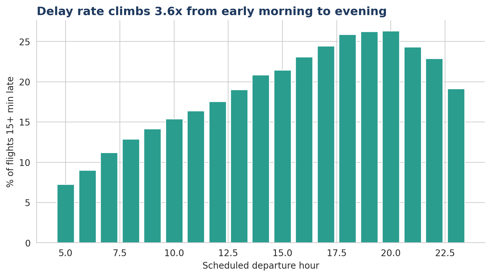
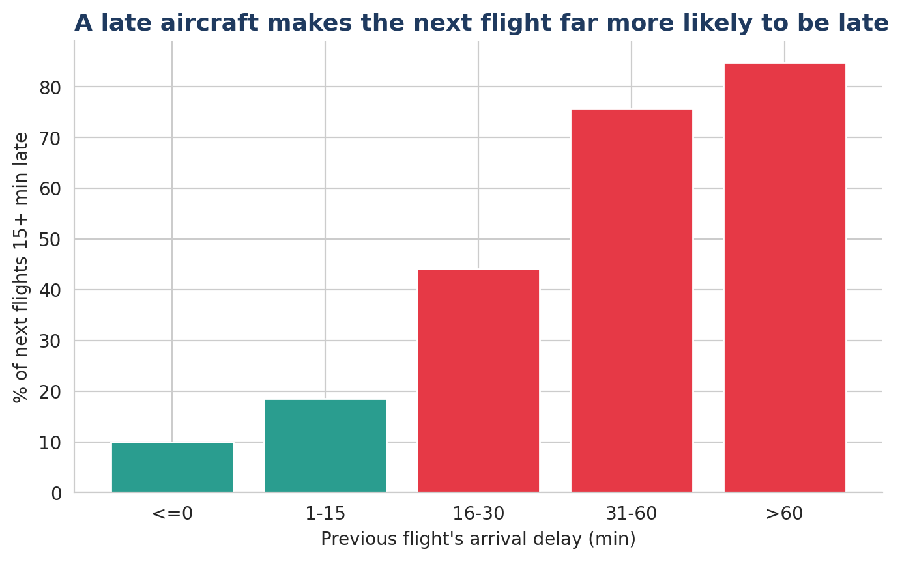
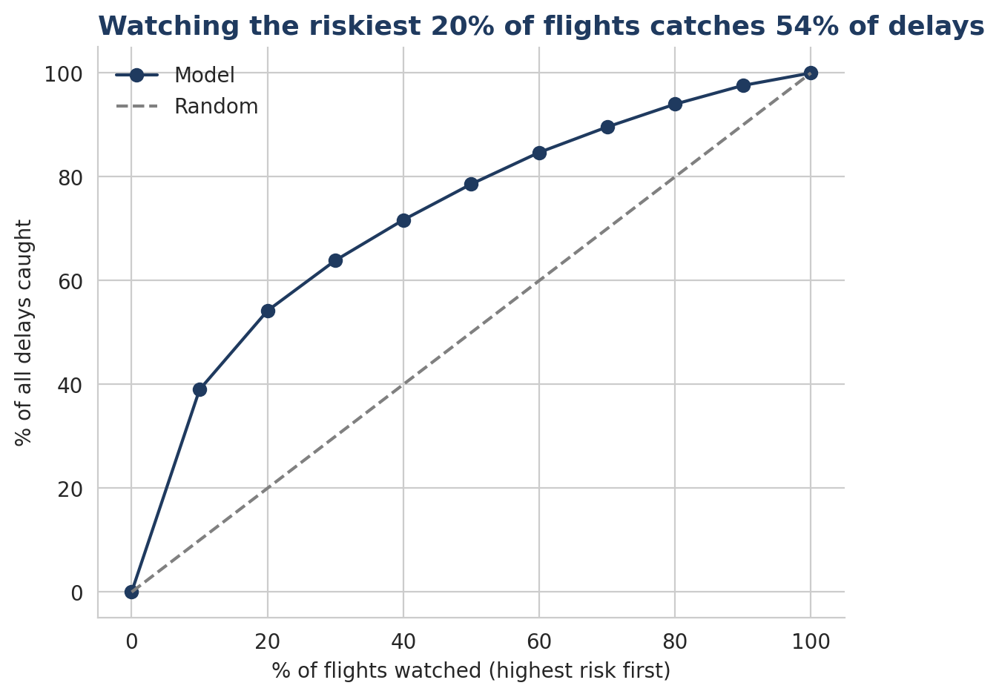
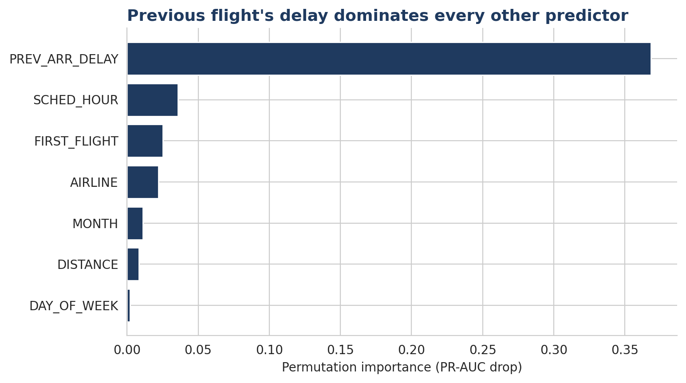

# Part 4: Python | Can We Prove It, and Can We Predict It?

Part 4 of the Airline Delay Tool Mastery Series. The same business problem solved across Excel, SQL, Power BI and Python. Excel showed what happens, SQL showed how delays chain together, Power BI showed where they concentrate. Python tests which of those patterns are statistically real and whether delays can be predicted.

**Dataset:** [2015 Flight Delays and Cancellations (US DOT, Kaggle)](https://www.kaggle.com/datasets/usdot/flight-delays) | 5,819,079 flights
**Tools:** Python, pandas, SciPy, scikit-learn, seaborn, Google Colab

## Key Findings

1. **When you fly matters more than who you fly with.** Evening departures (5 to 9 PM) are delayed 25.5% of the time versus 11.4% for morning departures (5 to 9 AM), an odds ratio of 2.65. Carrier differences are statistically significant but small in effect (Cramer's V = 0.084).
2. **Delays snowball along an aircraft's day.** When the previous flight on the same aircraft landed on time, 9.9% of next flights were late. After a delay of 31 to 60 minutes it was 75.7%, and over 60 minutes it was 84.8%. Late aircraft is the largest single cause of delay minutes (39.8%).
3. **The previous flight's delay is the strongest early-warning signal.** A model using only schedule information reached a PR-AUC of 0.276. Adding the previous flight's delay raised it to 0.54, and a random forest reached 0.579 (random guessing scores 0.186).
4. **A small watchlist captures most delays.** The riskiest 10% of flights contain 39.0% of all delays, and the riskiest 20% contain 54.2%.
5. **The model holds up on unseen months.** Trained on January to September and tested on October to December, it reached ROC-AUC 0.762 and PR-AUC 0.539.

## Data Audit

Every null in the dataset has a documented reason:

- The five delay-cause columns are filled only for flights 15 or more minutes late, so about 82% nulls are structural, not missing data.
- Null arrival delays (15,187) match diverted flights exactly. Null tail numbers belong to cancelled flights.
- Operated flights (not cancelled, not diverted) form the base for all delay analysis: 5,714,008 flights, with an 18.61% delay rate.
- **Airport ID quirk:** all October records use numeric airport IDs instead of IATA codes (100% of October, 0% of other months), a source format change. The airports table cannot map them, so these flights are kept for carrier, time and cause analysis and flagged out only for airport-level work. About 8.5% of operated flights are affected.

## Methodology

- **Delay definition:** arrival delay of 15 minutes or more (US DOT standard).
- **Hypothesis tests:** chi-square and Kruskal-Wallis for carriers, two-proportion z-test with confidence interval and odds ratio for time of day. With millions of rows every p-value is tiny, so effect sizes are reported next to each test.
- **Delay cascade:** each flight linked to the previous operated flight of the same aircraft on the same day (4.35M flights), grouped by how late that previous flight was.
- **Models:** logistic regression (Model A: schedule only, Model B: adds previous flight delay) and a random forest, trained on a 1M-row sample. Departure delay and cause columns were excluded to avoid data leakage, since they are only known after the fact.
- **Metrics:** PR-AUC is the headline metric because only about 19% of flights are delayed.
- **Validation:** decile lift analysis plus a time-based train/test split.

## Business Recommendations

1. Treat a late inbound aircraft as an alert. Once the previous leg lands more than 30 minutes late, the next flight is delayed about three times out of four, so gates, crew and ground teams should be reassigned immediately.
2. Build slack into the 5 to 9 PM departure banks, where the snowball peaks.
3. Monitor the riskiest 20% of flights each day instead of everything.

## Limitations

- Results show association, not proof of causation. Weather or congestion can delay two flights in the same chain.
- Delay causes are airline-reported, and weather is probably understated.
- Model B assumes the previous flight has landed before the prediction is made.
- Models were trained on a 1M-row sample due to Colab memory limits. The time-split version excludes the month feature.
- The data covers only 2015.

## Charts

## Series

[Excel](../excel) | [SQL](../sql) | [Power BI](../powerbi) | **python**
