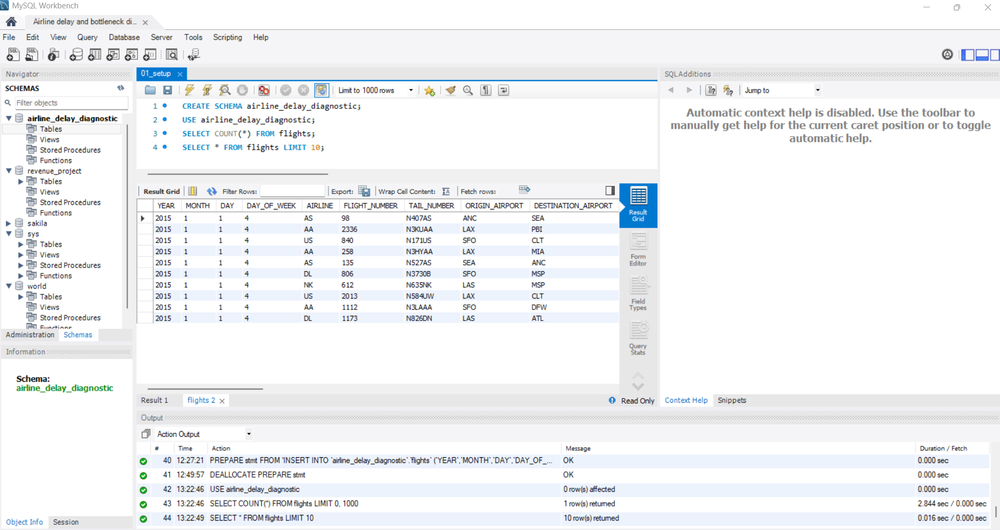
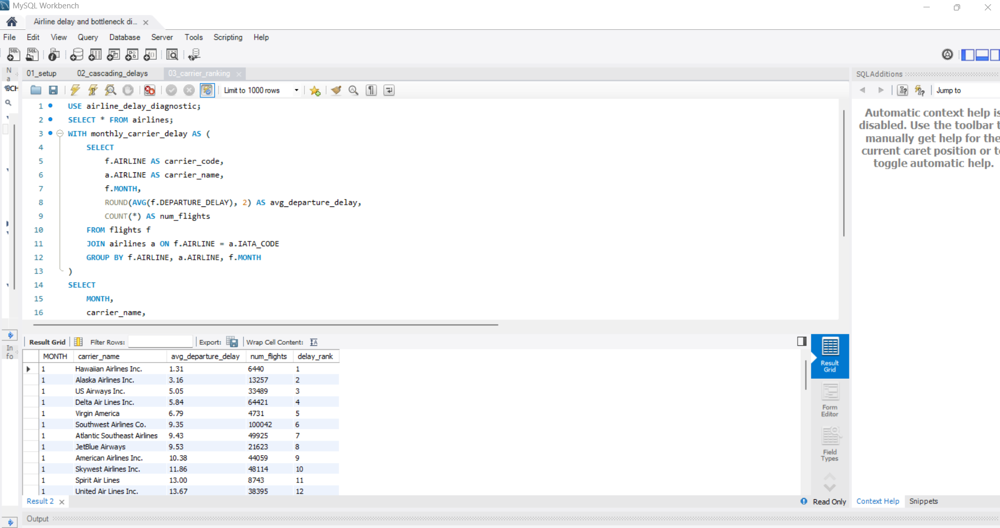
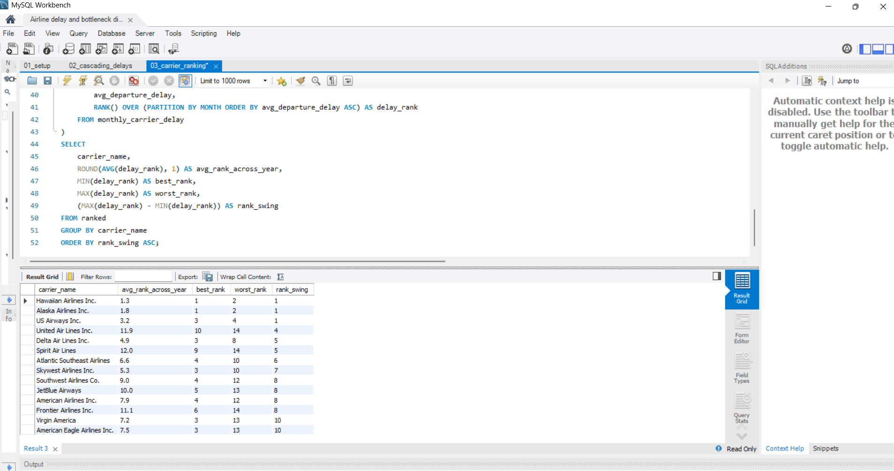
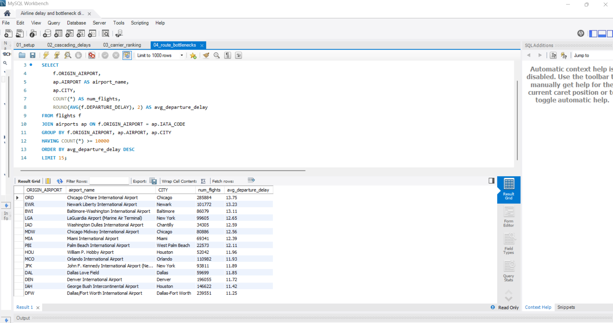
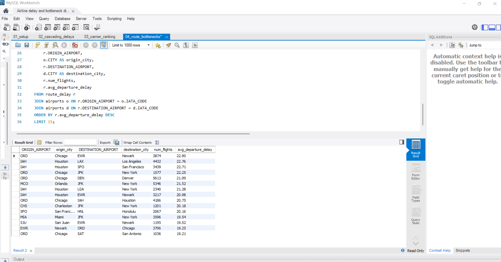
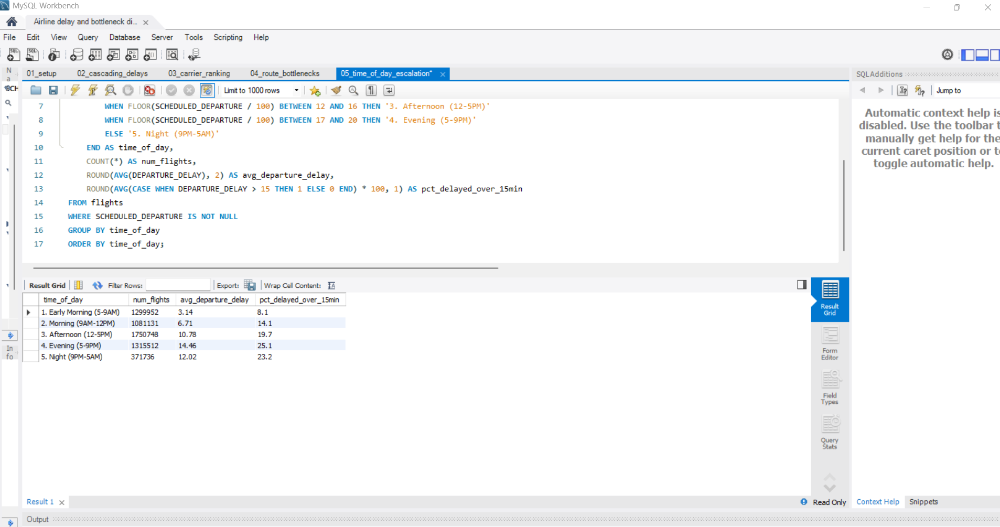
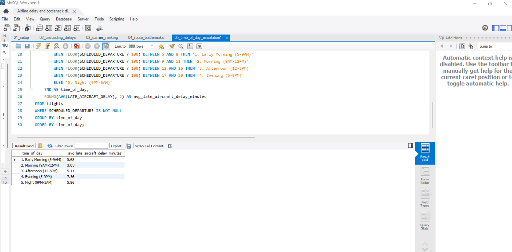

# Part 2: SQL Analysis — Airline Delay & Bottleneck Diagnostic

## Business Problem

Flight delays cost airlines, airports, and passengers time and money — but *why* delays happen, where they concentrate, and how they spread through the day is often invisible in flat, row-level reporting. This phase asks: how does delay propagate through the system, not just how much of it exists?

This is Part 2 of a four-part Tool Mastery Series solving the same underlying business problem across Excel, SQL, Power BI, and Python — with each tool used for what it does best, rather than repeating the same analysis in a new interface.

## Why SQL, and Why Differently From Excel

The Excel phase (Part 1) answered *what* the delay landscape looked like for December 2015: KPIs, carrier comparisons, a static dashboard. SQL isn't a better version of that — it's suited to a different class of question entirely: relational, sequential, and rule-based questions that a flat spreadsheet can't easily answer.

This phase deliberately avoids re-deriving Excel's KPIs. Instead, it uses SQL-native techniques — window functions, self-referencing joins, CTEs — to answer four questions Excel could not:

1. Does a delay in one flight carry over into that aircraft's *next* flight the same day, and by how much?
2. Are certain carriers *consistently* reliable, or just occasionally good?
3. Which specific airports and routes are chronic, high-volume bottlenecks — not just unlucky outliers?
4. Does delay severity escalate predictably through the day, and if so, why?

## Scope Note: Full Year, Not Just December

The Excel phase analyzed December 2015 only. For this phase, the scope was deliberately expanded to the **full year of 2015 (~5.82M flights)**. December-only data can't support month-over-month comparison — and one of the core SQL techniques here (ranking carriers via window functions partitioned by month) needs multiple months to be meaningful. Full-year data also allows genuine seasonal and consistency analysis that a single-month snapshot cannot.

## Dataset

Source: [2015 Flight Delays and Cancellations](https://www.kaggle.com/datasets/usdot/flight-delays) (U.S. DOT, via Kaggle) — `flights.csv` (full year, ~5.82M rows), plus lookup tables `airlines.csv` (carrier code → name) and `airports.csv` (airport code → name/city).

## Tools

MySQL Workbench 8.0, with data loaded via `LOAD DATA LOCAL INFILE` (run through the MySQL command-line client after Workbench's GUI import wizard proved unreliable at this scale — see Setup notes below).

## Files in This Folder

| File | Purpose |
|---|---|
| `01_setup.sql` | Schema creation, table definition, data load, row-count validation |
| `02_cascading_delays.sql` | Aircraft-level delay propagation using `LAG()` and CTEs |
| `03_carrier_ranking.sql` | Monthly carrier ranking and consistency analysis using `RANK()` |
| `04_route_bottlenecks.sql` | Airport and route-level bottleneck diagnostics using CTEs + `HAVING` |
| `05_time_of_day_escalation.sql` | Time-of-day delay escalation using `CASE WHEN` bucketing |
| `screenshots/` | Query + result grid screenshots referenced below |

---

## 01 — Setup & Data Validation

Created the `airline_delay_diagnostic` schema and a 31-column `flights` table matching the raw CSV structure, with delay/time fields stored as integers (the dataset encodes times in military format, e.g. `1430` = 2:30 PM, not as a native `TIME` type).

**Note on import method:** Workbench's Table Data Import Wizard failed repeatedly on this dataset — it processes rows one at a time and threw a blocking error on every cancelled flight, which has a blank (not zero) `DEPARTURE_DELAY` value. Rather than fight the GUI, I switched to `LOAD DATA LOCAL INFILE` via the MySQL command-line client (`mysql --local-infile=1`), which handles blank numeric fields correctly by converting them to `0` and loaded the full file in under two minutes.

Row count validated post-import at **5,819,079** — matching the expected full-year total exactly, confirming no silent truncation (the same discipline that caught Excel's 1,048,576-row ceiling in Part 1).

---

## 02 — Cascading Delay Analysis

**Business question:** When an aircraft's incoming flight lands late, how much of that delay carries into its *next* scheduled flight the same day?

**Technique:** `LAG()` window function, partitioned by tail number (the physical aircraft) and day, ordered by scheduled departure — pulling each flight's previous-flight arrival delay onto the same row without a manual self-join. Wrapped in a CTE to compute the raw chain first, then aggregated in a second pass.

**Finding:** Flights whose aircraft arrived more than 15 minutes late from its previous flight averaged **45.30 minutes** of departure delay — over **11x higher** than flights where the incoming aircraft was on time (4.07 min) or where it was the aircraft's first flight of the day (4.84 min).

Delay is not evenly distributed noise across the network — it is, in large part, a property of the aircraft's day. A single late landing measurably compounds into the next flight.

---

## 03 — Carrier Ranking & Consistency

**Business question:** Which carriers perform best on average — and separately, which are *consistently* reliable versus occasionally great but unpredictable?

**Technique:** Joined `flights` to the `airlines` lookup table for readable carrier names, then used `RANK()` (not `DENSE_RANK()`, to preserve honest gaps after ties) partitioned by month to rank every carrier's average departure delay within each month. A second query aggregated each carrier's rank swing (`MAX(rank) − MIN(rank)`) across all 12 months to separate consistent performers from volatile ones.

**Finding:** Hawaiian Airlines ranked in the top 2 nationally in **every single month** of 2015 (average rank 1.3, rank swing of only 1). Alaska Airlines and US Airways were similarly stable. At the other end, carriers like Virgin America and American Eagle swung by 10 rank positions across the year — top-3 some months, dead last (13th of 14) in others.

Average performance and consistency are distinct operational traits. A carrier that is reliably mid-tier every month is a different (and arguably safer) bet than one that is occasionally excellent but structurally unpredictable.

---

## 04 — Route & Airport Bottleneck Diagnostics

**Business question:** Which airports and routes are genuine, high-volume bottlenecks — not just small samples of bad luck?

**Technique:** Joined `flights` to `airports` for readable names, grouped by origin airport, and filtered with `HAVING COUNT(*) >= 10000` so only major hubs with meaningful traffic volume were compared — a small regional airport with a handful of bad delays would otherwise skew the ranking. Extended to route-level (origin–destination pairs) using a CTE, joining the `airports` table twice under different aliases to pull both origin and destination city names in one query.

**Finding:** Chicago O'Hare (ORD) was the worst-performing major U.S. airport — averaging 13.75-minute departure delays across 285,884 flights, the highest volume of any hub in the list, confirming this is structural rather than incidental. At the route level, **ORD → Newark (EWR)** was the single worst route nationally at 22.9-minute average departure delay — nearly double the airport-level average, since it compounds congestion at both ends. Houston's IAH also repeatedly appeared as the origin for the most-delayed westbound routes (to LAX, SFO), suggesting a route-specific rather than purely airport-wide pattern.

---

## 05 — Time-of-Day Escalation

**Business question:** Does delay severity build up predictably as the day goes on, and does that connect back to the cascading effect found in section 02?

**Technique:** `CASE WHEN` bucketing on the extracted hour (`FLOOR(SCHEDULED_DEPARTURE / 100)`) into five time-of-day windows, with numbered label prefixes to force chronological (not alphabetical) sort order. Measured both average delay and the percentage of flights delayed over 15 minutes, since a raw average can be skewed by a small number of extreme outliers.

**Finding:** Average departure delay climbed from **3.14 minutes** in early morning to **14.46 minutes** by evening — nearly a 5x increase — while the share of flights delayed over 15 minutes rose from 8.1% to 25.1%. One in four evening flights was meaningfully delayed, versus fewer than one in twelve in the early morning.

To test the mechanism, `LATE_AIRCRAFT_DELAY` (a delay-cause field already broken out in the raw data) was tracked across the same time buckets:

Delay attributable specifically to a late-arriving aircraft rose from **0.68 minutes** in early morning to **7.36 minutes** by evening — roughly a 10x increase, closely tracking the overall escalation. This confirms the mechanism identified in section 02: a large share of the afternoon/evening delay increase is the accumulated cascade from earlier flights that same day, not an unrelated evening-specific cause. Night flights show a partial reset, consistent with aircraft starting fresh rotations overnight.

---

## Synthesis

These four analyses connect into a single mechanism rather than four separate findings:

- Delay **propagates** aircraft-to-aircraft within a day (section 02).
- It **concentrates** at specific high-volume hub bottlenecks, most severely where two congested hubs share a route (section 04).
- It **compounds** through the day as a direct, measurable consequence of that propagation (section 05).
- Carriers absorb this system-wide pressure with very different degrees of consistency, independent of their raw average performance (section 03).

## SQL Techniques Demonstrated

`LAG()` and window functions · `PARTITION BY` · `RANK()` vs `DENSE_RANK()` · CTEs (`WITH`) · self-referencing joins (same table joined twice under different aliases) · `HAVING` vs `WHERE` for post-aggregation filtering · `CASE WHEN` bucketing · `LOAD DATA LOCAL INFILE` via CLI

---

*Part of the [Tool Mastery Series](../README.md). Next: Power BI.*
